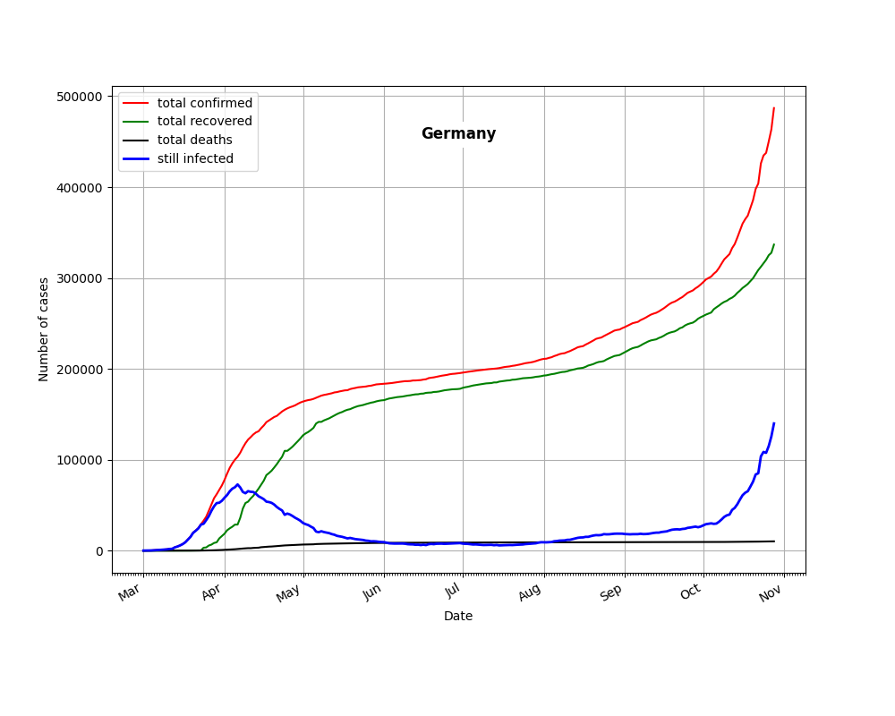
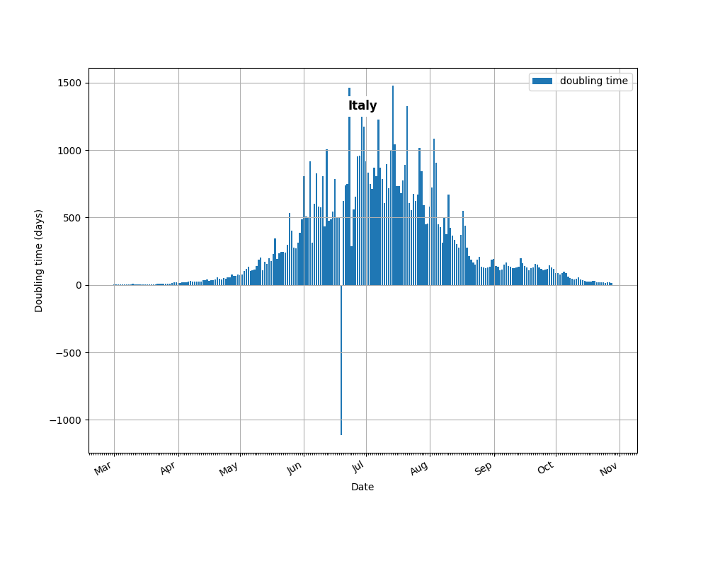
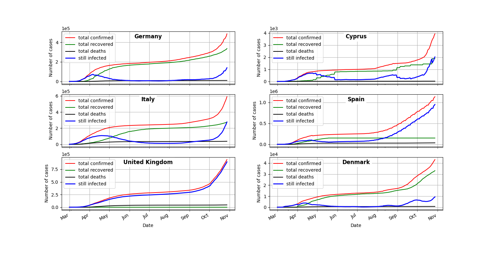
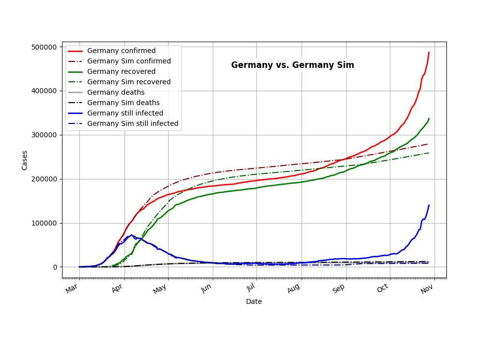

# covid19_analysis

## Short description
A python script that basically visualizes data from the CSSE GitHub data set. The CSSE data can be found here: https://github.com/CSSEGISandData/COVID-19.git

## Usage
The script expects the data in a folder "COVID-19" which resides in the same root-folder as "covid19_analysis":

```
./SomeRootFolder/
        |---> COVID-19
        |---> covid19_analysis

```

## Doc-View Model
Simple usage of the classes is demonstrated in `analyse_data.py`. In principle the code is split into the files

* `covid_doc.py` and
* `covid_view.py`

The classes in `covid_doc.py` are used to parse the cvs-files and store the data in either `CTimeSeriesData` objects or `CTimeSeriesDataCollection` objects.

The classes in `covid_view.py` are used to visualize the data of the doc-classes. For the moment they are based on `Matplotlib`. At the moment the classes 
* `CTimeSeriesDataView` and
* `CTimeSeriesDataCollectionView`
are available

## Dependencies
You need to have the following modules installed:
* `matplotlib`
* `numpy`
* `logzero`

## Examples

### Single data set


### Time in days to dublicate number of cases


### Collection plot of times series data 


### Comparison of data set and simulation 



